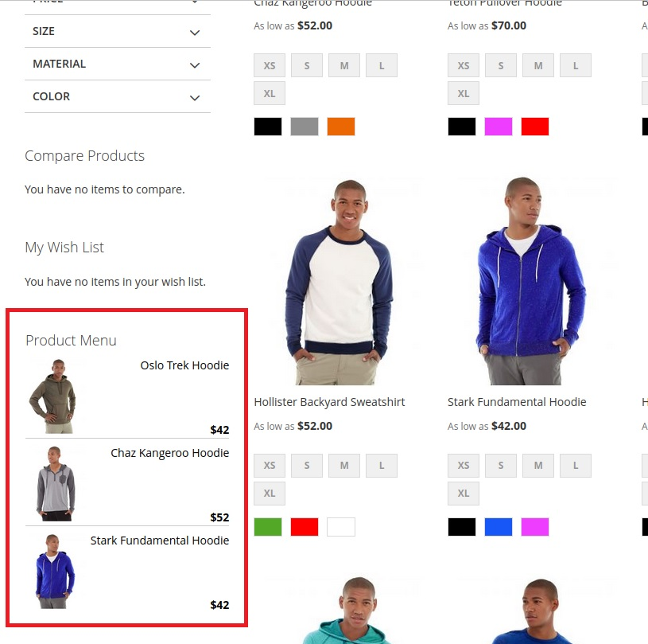

# Magento 2 Product Menu Extension

This Magento 2 module displays 3 simple products of the selected category in the sidebar. When you refresh the page, the products change.



## Requirements
* Magento Community Edition 2.1.x-2.4.x or Magento Enterprise Edition 2.1.x-2.4.x

## Installation
* Download [ZIP Archive](https://github.com/nordraw/magento2-product-menu/archive/refs/heads/master.zip)
* Extract files
* In your Magento 2 root directory create folder app/code/Tretiak/ProductMenu
* Copy files and folders from archive to that folder
* Run commands:
```
php bin/magento module:enable Tretiak_ProductMenu
php bin/magento setup:upgrade
```

## Have questions?
Questions and wishes write to email:
nikita.tretyak093@gmail.com
